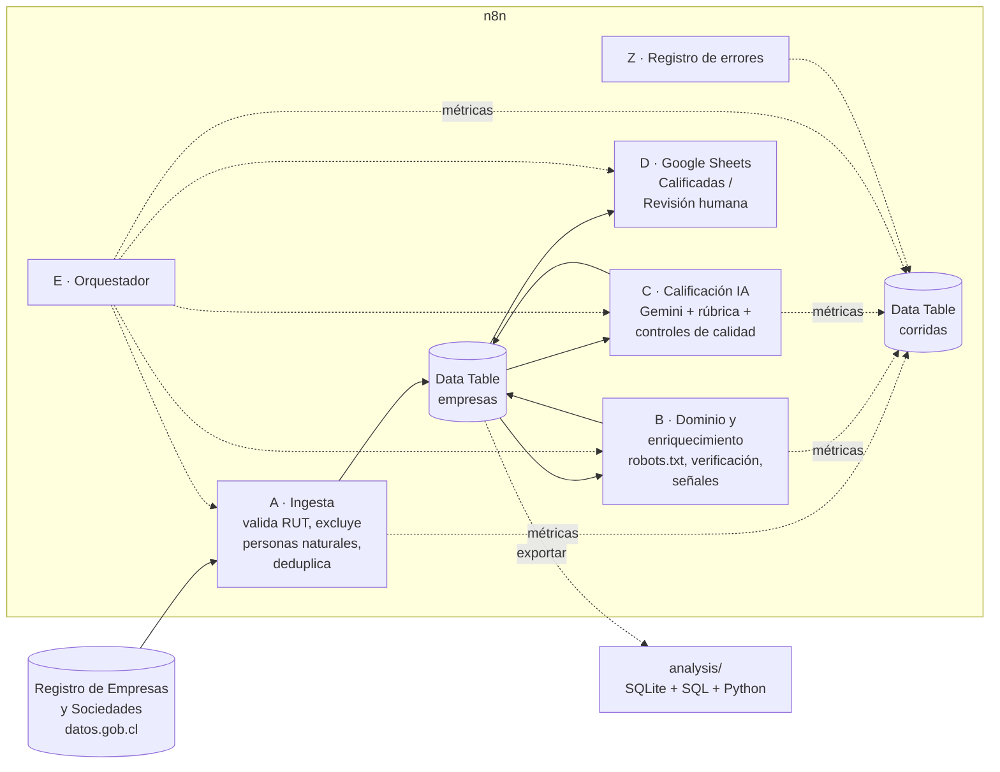

# prospeccion-ley-21719

Pipeline de prospección en frío con n8n + IA. Demo que construye en **n8n** un pipeline que toma empresas chilenas de una **fuente pública**, las normaliza y deduplica, busca su sitio web, detecta **señales de cumplimiento de la Ley 21.719** de protección de datos personales y las **califica con IA (Gemini) con revisión humana**, dejando el resultado en una Data Table y en Google Sheets, con métricas de cada corrida.

> **Datos públicos.** Todo el repositorio usa solo información pública de **personas jurídicas** (Registro de Empresas y Sociedades, licencia CC-BY) y de sus sitios web. No contiene datos personales, credenciales ni datos completos de la corrida. Ver [Datos y privacidad](#datos-y-privacidad).

## El problema

La Ley 21.719 entra en vigencia el **1 de diciembre de 2026** (hay un proyecto de postergación en trámite, Boletín 18.623-07). Un equipo comercial que vende cumplimiento necesita encontrar empresas que **tratan muchos datos personales** y **no muestran señales de estar preparadas**, sin revisar sitios a mano.

## Arquitectura



| Workflow | Qué hace | Archivo |
|---|---|---|
| **A · Ingesta RES** | Descarga el CSV oficial, valida el RUT (módulo 11), excluye personas naturales, EIRL y holdings, filtra por región y capital y deduplica contra la tabla | [`workflows/A_ingesta.json`](workflows/A_ingesta.json) |
| **B · Dominio y enriquecimiento** | Genera dominios candidatos desde la razón social, respeta `robots.txt`, verifica que el sitio sea de la empresa y extrae señales de cumplimiento | [`workflows/B_enriquecimiento.json`](workflows/B_enriquecimiento.json) |
| **C · Calificación con IA** | Gemini clasifica rubro, propone un ajuste con evidencia y confirma el sitio; el código aplica la rúbrica y deriva lo dudoso a revisión humana | [`workflows/C_calificacion.json`](workflows/C_calificacion.json) |
| **D · Exportar a Sheets** | Reescribe la planilla desde la Data Table (fuente de verdad) | [`workflows/D_exportar_sheets.json`](workflows/D_exportar_sheets.json) |
| **E · Orquestador** | Ejecuta A→B→C→D con un mismo `run_id` y registra el estado de cada etapa | [`workflows/E_orquestador.json`](workflows/E_orquestador.json) |
| **Z · Registro de errores** | Workflow de error: guarda workflow, nodo y mensaje en `corridas` | [`workflows/Z_errores.json`](workflows/Z_errores.json) |

## Fase 2: fuentes de sectores regulados

La fase 1 partía del Registro de Empresas y Sociedades y solo 6,5 % de las empresas tenía sitio web. La fase 2 parte del **perfil de cliente ideal** usando registros oficiales de sectores que tratan datos sensibles. Detalle en [`docs/fuentes-fase2.md`](docs/fuentes-fase2.md).

| Workflow / script | Qué hace |
|---|---|
| **A2 · Ingesta sectores regulados** | Descarga el listado de **prestadores de salud acreditados** (Superintendencia de Salud, 1.018 prestadores) y toma de cada ficha el RUT, el propietario, el tipo de establecimiento y el **sitio web oficial**. No guarda teléfono, dirección ni datos del representante legal |
| `scripts/cruce_sii.py` | Recorre la **nómina de personas jurídicas del SII** (378 MB, fuera de n8n) y carga en la tabla `sii_referencia` solo los RUT del pipeline: tramo de ventas, trabajadores y rubro |
| **A3 · Cruce SII** | Pasa a `empresas` el tamaño, los trabajadores y el rubro del SII; C los usa en la rúbrica y en la ficha para la IA |
| **B** (ajustado) | Si la fuente oficial informó el sitio, prueba solo ese (y acepta que una red de clínicas comparta la web) |
| **E** (ajustado) | Parámetro `fuente`: `regulados` (A2 → A3) o `res` (A) |

**Resultado del cambio de fuente** (misma lógica de B, C y D):

| Fuente | Empresas | Con sitio verificado | Medianas o grandes según el SII |
|---|---|---|---|
| Registro de Empresas y Sociedades (fase 1) | 200 | 13 (**6,5 %**) | 7 |
| Superintendencia de Salud (fase 2) | 34 | 23 (**67,6 %**) | 31 |

Con la fuente correcta, 10 veces más empresas llegan a la etapa de IA y casi todas tienen un tamaño que justifica un contacto comercial. La lección: en prospección, elegir bien la fuente rinde más que afinar el modelo.

**CMF (registro fintech):** el listado público funciona desde un navegador, pero a las solicitudes automatizadas de n8n la CMF responde con un desafío anti-bots. No se intentó evadirlo; la vía correcta es pedir el listado por sus canales oficiales o por Ley de Transparencia.

## Decisiones de diseño

- **Lógica testeable fuera de n8n.** La lógica de cada nodo Code vive en [`n8n/code/`](n8n/code) y [`lib/`](lib); [`scripts/build_code.py`](scripts/build_code.py) la inserta en el workflow. Así se prueba con `node --test` antes de subirla (34 tests). El arnés de tests anula `URL` porque el sandbox de n8n no la tiene: así se encontró un bug real.
- **Puntaje híbrido.** Las reglas deterministas (auditables) dan el puntaje base; la IA solo puede ajustarlo ±15 y debe citar evidencia. Ver [`docs/icp-rubrica.md`](docs/icp-rubrica.md).
- **Revisión humana por defecto ante la duda.** Va a revisión todo lo que tenga JSON inválido, evidencia que no sea una URL visitada, confianza < 0,6, error de la API o un sitio que la IA considera ajeno.
- **Verificación estricta del dominio.** Una primera versión aceptaba coincidencias de una sola palabra (`gonzalez.cl`, `minera.cl`): 43 falsos positivos en una simulación. La versión actual exige RUT, marca de una palabra en el título o la frase completa del nombre, y descarta dominios en venta o compartidos.
- **Señales solo de lo que ve un visitante, con evidencia.** La primera versión buscaba palabras como `login` o `woocommerce` en todo el HTML: landings simples aparecían como "e-commerce con login" porque tenían un plugin instalado sin usar. Al revisar los resultados, 4 de 8 señales eran falsas. Ahora login, tienda online y agenda son señales separadas que exigen texto visible y evidencia estructural (campo de contraseña, botón de carrito y precios), los sitios mínimos ("coming soon", menos de 150 palabras) no suman viabilidad ni pasan directo a ventas, y cada señal guarda el fragmento que la activó. La IA recibe esa evidencia y debe listar las señales que el texto no respalda.
- **Políticas de privacidad: dónde están y de quién son.** Las tiendas Shopify publican la política en `/policies/privacy-policy`, así que se busca la ruta conocida de cada plataforma. Una página solo cuenta como política si su título lo dice y su cuerpo usa términos propios de una (tratamiento, finalidad, derechos): antes bastaba la palabra "Privacidad" en el pie, y hasta un 404 contaba. Se distingue entre política **propia** y **plantilla** (la que genera Shopify o un generador externo): la plantilla es válida pero genérica y no traslada la responsabilidad, porque la tienda sigue siendo responsable de los datos de sus clientes aunque use Shopify. El año se toma de "última actualización", no del "© 2026" del pie.
- **Un bug que los tests locales no veían.** El nodo HTTP de n8n a veces entrega el cuerpo de la respuesta en `data` en vez de `body`. Mis nodos leían solo `body`, así que dentro de n8n la política de privacidad nunca se analizaba y **las reglas de `robots.txt` tampoco se aplicaban** (aunque en la práctica solo se visitaba la portada y una ruta de política por sitio). Lo detecté al ver que una tienda con política en local salía "sin política" en n8n; agregué a cada empresa un diagnóstico de la descarga (código HTTP, bytes, error), unifiqué la lectura en `cuerpoRespuesta()` y sumé un test con la respuesta en `data`.
- **Resistencia a prompt injection.** El texto del sitio se entrega como dato, con instrucción explícita de ignorar instrucciones contenidas en él (hay un test con un sitio que intenta manipular el puntaje).
- **Idempotencia.** Ejecutar la ingesta dos veces no duplica empresas (clave `rut:`); la planilla se regenera completa desde la Data Table.
- **Observabilidad.** Cada etapa escribe una fila en `corridas` (procesadas, nuevas, duplicadas, con/sin dominio, calificadas, errores y un diagnóstico de por qué se descartó cada candidato).

## Métricas

Resultados de 3 corridas reales (7 de octubre de 2026, archivo RES 2018). Reporte completo y gráficos en [`analysis/output/reporte.md`](analysis/output/reporte.md).

| Métrica | Valor |
|---|---|
| Filas del RES procesadas por corrida | 101.998 (6–15 s por corrida) |
| Excluidas por ser personas naturales, EIRL o capital atípico | 30.245 |
| Empresas ingresadas (únicas) | 200 · 0 duplicadas en la tabla |
| Duplicados detectados y evitados en re-ejecuciones | 272 |
| Con dominio verificado | 13 (6,5 %) |
| Calificadas por la IA | 13 → **2 calificadas**, 11 a revisión humana |
| Sitios que la IA detectó como **ajenos** a la empresa | 5 (dominio en venta, clínica de EE.UU., tienda catalana, página vacía, inmobiliaria cuyo sitio es una clínica) |
| Respuestas de la IA con JSON válido | 100 % de las recibidas (los fallos fueron 503/429 de la API → revisión) |
| Empresas con sitio **sin política de privacidad** | 13 de 13 · ninguna cita la Ley 21.719 |
| Tiempo de calificación | ~25 s por empresa (pausa para respetar el límite gratuito de la API) |


**Lectura:** el pipeline es conservador por diseño: prefiere mandar a revisión humana antes que entregar al equipo comercial una cuenta mal identificada. El cuello de botella es la fuente (pocas sociedades del RES tienen sitio), no el procesamiento.

## Cómo correrlo

Requisitos: n8n (probado en Docker), Node 20+, Python 3.11+, una API key de Google Gemini y (opcional) una credencial OAuth de Google Sheets con la **Google Sheets API habilitada**.

1. En n8n, crea las Data Tables `empresas` y `corridas` con las columnas de [`docs/tablas.md`](docs/tablas.md).
2. Importa los JSON de [`workflows/`](workflows). Reemplaza los marcadores `TABLA_EMPRESAS`, `TABLA_CORRIDAS` y `WORKFLOW_*` por los IDs de tu instancia y asigna tus credenciales (`<tu credencial ...>`).
3. Ejecuta `D0 · Crear planilla` una vez y reemplaza `ID_PLANILLA` en el workflow `D` por el ID de la planilla creada.
4. Ejecuta `E · Orquestador del pipeline`.

Desarrollo local:

```bash
node --test test/normalize.test.js test/senales.test.js test/n8n_code.test.js
python scripts/build_code.py n8n/sdk/B_enriquecimiento.sdk.ts --out data/raw/build/B.ts
node scripts/simular_b.js data/raw/empresas.json 50     # simula el workflow B contra sitios reales
python scripts/exportar_tablas.py && python analysis/metricas.py
python scripts/check_secrets.py .                       # antes de cada commit
```

## Datos y privacidad

Este repositorio es público, así que se diseñó para no exponer nada que no lo sea:

- **Fuente:** [Registro de Empresas y Sociedades](https://datos.gob.cl/dataset/363edd60-4919-4ff1-b85f-f8e14d61285a) (Subsecretaría de Economía y Empresas de Menor Tamaño), publicado en datos.gob.cl con licencia **Creative Commons Attribution (CC-BY)**. Se usan razón social, RUT de la sociedad, región, año y capital.
- **Solo personas jurídicas.** Se descartan RUT bajo 50.000.000 (personas naturales) y las **EIRL**, porque su razón social suele ser el nombre de una persona (30.244 excluidas en el archivo 2018).
- **Sin datos personales de terceros.** No se buscan ni guardan nombres, correos o teléfonos de personas. Del sitio solo se registran **señales** (¿tiene política de privacidad?, ¿usa cookies?) y se anota *si existe* un canal de privacidad, no cuál es.
- **Rastreo respetuoso.** Se consulta `robots.txt` antes de visitar cada sitio, con un User-Agent que se identifica, timeouts y pausas entre solicitudes. Solo se visitan la portada y la política de privacidad.
- **Nadie fue contactado.** El pipeline no envía correos ni formularios.
- **Lo que está en el repo:** código, workflows sin credenciales, métricas agregadas y una **muestra de hasta 20 empresas** ([`data/sample/`](data/sample)) con campos estructurados de dominio público. Se excluyen de la muestra las empresas cuyo sitio la IA marcó como ajeno, para no asociar una empresa a un sitio que no es suyo.
- **Lo que NO está:** los datos completos, el texto extraído de los sitios y las credenciales viven solo en la instancia local de n8n (`data/raw/` está en `.gitignore`). [`scripts/check_secrets.py`](scripts/check_secrets.py) revisa JWT, API keys, tokens, correos y RUT de personas naturales antes de cada commit.

## Limitaciones y próximos pasos

- **Pocas empresas del RES tienen sitio web** (11 % en las de mayor capital, ~2 % en el resto). El registro está dominado por sociedades nuevas y holdings. Próximo paso: cruzar con la nómina de personas jurídicas del SII (rubro, tramo de ventas y trabajadores) y priorizar rubros del ICP antes de buscar dominios.
- La verificación por nombre es conservadora: prefiere perder empresas a asociar sitios equivocados.
- La rúbrica asigna puntajes parecidos a sitios sin política de privacidad; con más datos etiquetados (ver [`analysis/eval_agreement.py`](analysis/eval_agreement.py)) se pueden recalibrar los pesos.
- Integración con un CRM (HubSpot) y secuencias de contacto quedan fuera de este alcance.

## Estructura

```
docs/        fuente de datos, ICP y rúbrica, tablas
lib/         normalización de empresas y extracción de señales (JS, sin dependencias)
n8n/code/    código de cada nodo Code      n8n/sdk/   workflows en el SDK de n8n
workflows/   workflows exportados (JSON, sin credenciales)
scripts/     build, simulación local, exportación y revisión de secretos
analysis/    SQL + Python de métricas y evaluación de la IA
test/        tests (node --test)
data/sample/ muestra pública
```
