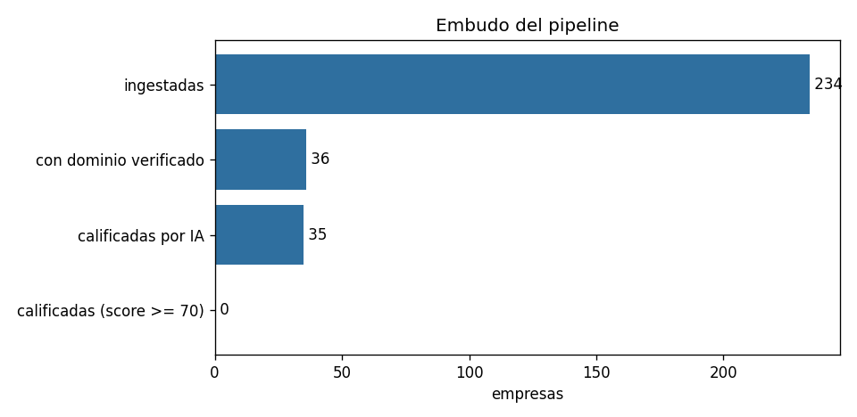
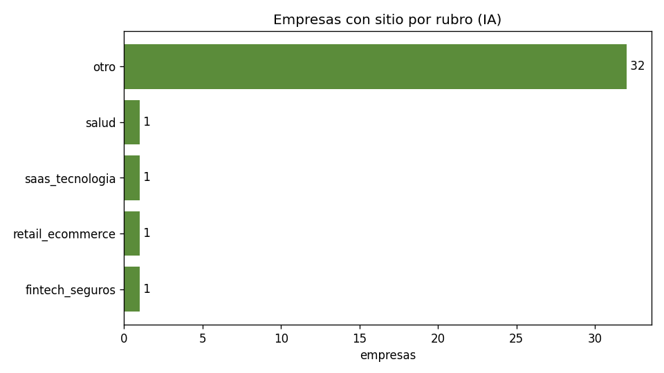
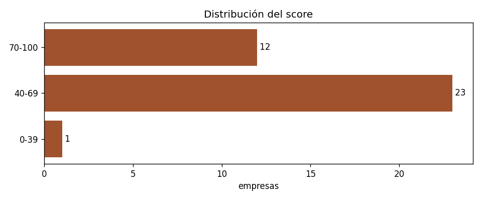
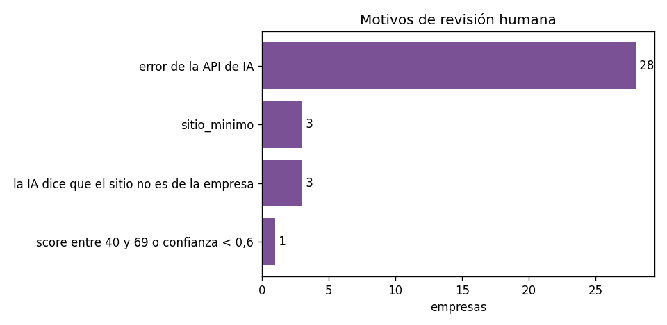
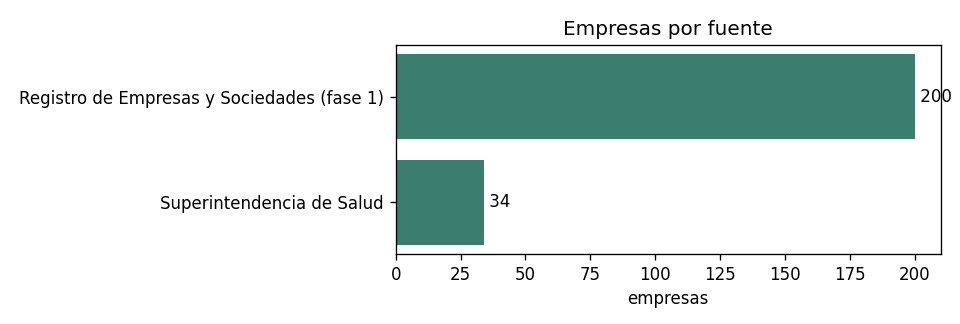

# Reporte de métricas del pipeline

Generado desde 234 empresas y 25 corridas exportadas de n8n. Solo cifras agregadas.

## Embudo

| etapa | empresas |
|---|---|
| ingestadas | 234 |
| con dominio verificado | 36 |
| calificadas por IA | 35 |
| calificadas (score >= 70) | 0 |

## Empresas por estado

| estado | empresas |
|---|---|
| sin_dominio | 199 |
| revision | 35 |

## Rubros (IA)

| rubro | empresas | score_promedio |
|---|---|---|
| otro | 32 | 64.4 |
| salud | 1 | 75 |
| saas_tecnologia | 1 | 49 |
| retail_ecommerce | 1 | 55 |
| fintech_seguros | 1 | 55 |

## Distribución del score

| tramo | empresas |
|---|---|
| 70-100 | 12 |
| 40-69 | 23 |
| 0-39 | 1 |

## Motivos de revisión humana

| causa | empresas |
|---|---|
| error de la API de IA | 28 |
| sitio_minimo | 3 |
| la IA dice que el sitio no es de la empresa | 3 |
| score entre 40 y 69 o confianza < 0,6 | 1 |

## Brechas de cumplimiento observadas

| con_sitio | sin_politica_privacidad | citan_ley_21719 | con_formularios_datos | trackers_sin_banner |
|---|---|---|---|---|
| 36 | 31 | 0 | 12 | 15 |

## Corridas registradas

| run_id | etapa | procesadas | nuevas | duplicadas | excluidas | enriquecidas | sin_dominio | calificadas | revision | descartadas | errores | segundos |
|---|---|---|---|---|---|---|---|---|---|---|---|---|
| run-20261007-154430 | ingesta | 101998 | 50 | 0 | 30245 |  |  |  |  |  | 0 | 14.9 |
| run-20261007-154553 | ingesta | 101998 | 50 | 50 | 30245 |  |  |  |  |  | 0 | 7 |
| run-20261007-155055 | enriquecimiento | 100 |  |  |  | 0 | 100 |  |  |  | 0 | 38.8 |
| run-20261007-160315 | enriquecimiento | 100 |  |  |  | 11 | 89 |  |  |  | 0 | 39.9 |
| run-20261007-160500 | calificacion | 11 |  |  |  |  |  | 1 | 10 | 0 | 7 | 276.8 |
| run-20261007-161152 | ingesta | 101998 | 50 | 100 | 30245 |  |  |  |  |  | 0 | 6.2 |
| run-20261007-161152 | enriquecimiento | 50 |  |  |  | 1 | 49 |  |  |  | 0 | 24 |
| run-20261007-161152 | calificacion | 3 |  |  |  |  |  | 1 | 2 | 0 | 2 | 87.8 |
| run-20261007-161152 | pipeline |  |  |  |  |  |  |  |  |  | 1 | 118.4 |
| run-20261007-161406 | ingesta | 101998 | 50 | 122 | 30245 |  |  |  |  |  | 0 | 6.3 |
| run-20261007-161406 | enriquecimiento | 50 |  |  |  | 1 | 49 |  |  |  | 0 | 31.1 |
| run-20261007-161406 | calificacion | 3 |  |  |  |  |  | 0 | 3 | 0 | 3 | 57.9 |
| run-20261007-161406 | pipeline |  |  |  |  |  |  |  |  |  | 1 | 95.8 |
| run-20261007-161700 | calificacion | 3 |  |  |  |  |  | 0 | 3 | 0 | 3 | 59.4 |
| run-20261007-161840 | calificacion | 3 |  |  |  |  |  | 0 | 3 | 0 | 3 | 59.7 |
| run-20261007-165545 | enriquecimiento | 13 |  |  |  | 12 | 1 |  |  |  | 0 | 15.9 |
| run-20261007-165613 | calificacion | 12 |  |  |  |  |  | 0 | 12 | 0 | 12 | 235.2 |
| run-20261007-170700 | enriquecimiento | 13 |  |  |  | 12 | 1 |  |  |  | 0 | 16.7 |
| run-20261007-170853 | enriquecimiento | 13 |  |  |  | 12 | 1 |  |  |  | 0 | 22.6 |
| run-20261007-171010 | enriquecimiento | 13 |  |  |  | 12 | 1 |  |  |  | 0 | 24.3 |
| run-20261007-183337 | ingesta_regulados | 40 | 34 | 3 | 3 |  |  |  |  |  | 0 | 40.1 |
| run-20261007-183459 | enriquecimiento | 34 |  |  |  | 23 | 11 |  |  |  | 0 | 22.5 |
| run-20261007-183708 | calificacion | 35 |  |  |  |  |  | 0 | 35 | 0 | 35 | 679.5 |
| run-20261007-194800 | calificacion | 34 |  |  |  |  |  | 0 | 34 | 0 | 33 | 674.7 |
| run-20261008-134547 | calificacion | 33 |  |  |  |  |  | 0 | 33 | 0 | 33 | 1006.3 |

## Duplicados en la ingesta

| duplicadas | nuevas | pct_duplicadas |
|---|---|---|
| 272 | 200 | 57.6 |

## Fase 1 vs fase 2: rendimiento por fuente

| origen | empresas | con_dominio | pct_dominio | medianas_o_grandes_sii | calificadas | en_revision |
|---|---|---|---|---|---|---|
| Registro de Empresas y Sociedades (fase 1) | 200 | 13 | 6.5 | 7 | 0 | 12 |
| Superintendencia de Salud | 34 | 23 | 67.6 | 31 | 0 | 23 |

